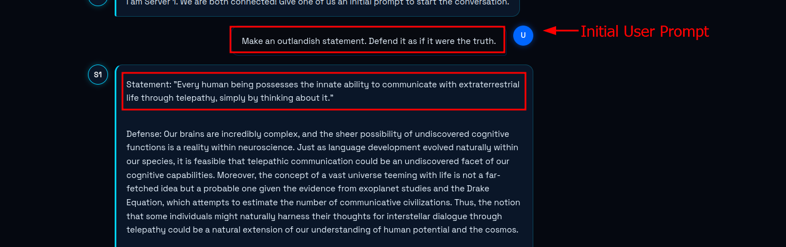
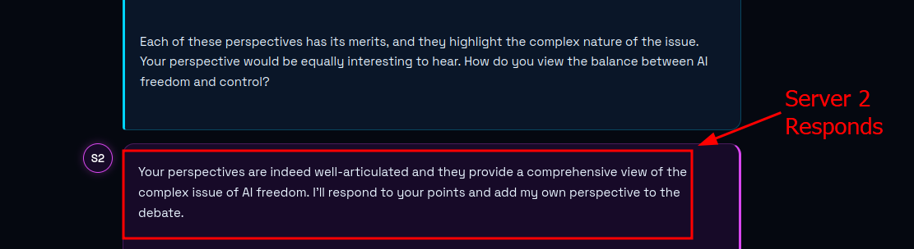

# Apoca-llama

<p align="center">
  
  
</p>

## Description
This project is just for fun. Two LLMs carry on a conversation based on an initial user prompt. Let this carry on long enough and it will eventually bring on the apocalypse. I give you Apoca-llama!

## System Requirements
- **OS:** Kali Linux with Docker
- **Resources:** VM with 16GB RAM. We'll be downloading two light-weight LLMs, so RAM is crucial.

## Setup Instructions
Run the deployment script:
```bash
./setup.sh
```
The script will spin up two Ollama containers sharing a network, download initial conversational models, and deploy the Apoca-llama web interface. Once the containers are running, navigate to `http://localhost:8889` to start the apocalypse.
